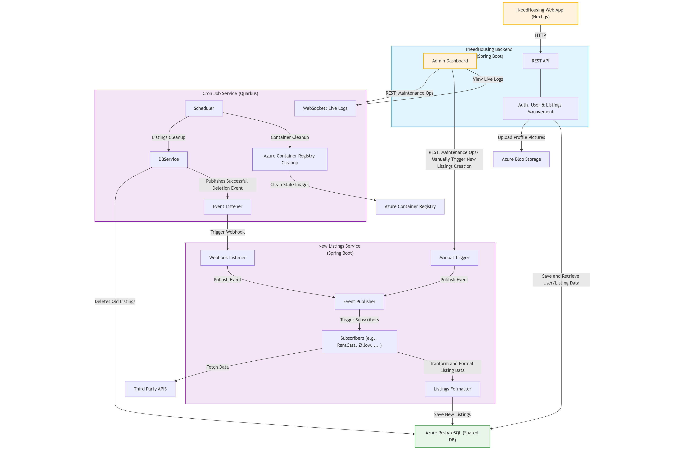

# [INeedHousing](https://i-need-housing.vercel.app)

## Overview

INeedHousing.com is a web application designed to help incoming interns and new-grad employees find housing near their workplace. The platform aggregates rental listings from various sources and provides a user-friendly interface for finding suitable accommodations.

## Features

- User registration and authentication
- Location-based property search
- Interactive map interface for property visualization
- Customizable housing preferences
- Email verification system
- Admin dashboard for property management
- Automated maintenance tasks via cron job service

## Tech Stack

- **Frontend**: Next.js 15.2.4 with Tailwind CSS + DaisyUI
- **Backend**: Spring Boot 3.4.4 with PostgreSQL
- **Microservices**: Quarkus 3.22.3-based cron job service
- **APIs**: Google Maps, Zillow, Airbnb, RentCast
- **Infrastructure**: Azure App Service (Backend), Vercel (Frontend), Azure Container Registry
- **CI/CD**: GitHub Actions with automated deployment to production

## Project Status

The project has successfully reached its MVP milestone and continues to evolve:

- ✅ **Complete MVP web application** - Fully functional and deployed
- ✅ **Frontend deployed** - Accessible on Vercel with modern Next.js 15
- ✅ **Backend services running** - Spring Boot application on Azure App Service
- ✅ **Core features implemented** - All major functionality tested and working
- ✅ **Cron job microservice** - Quarkus-based service for automated maintenance tasks
- ✅ **Automated deployment** - GitHub Actions workflow for production deployments
- 🔄 **Ongoing enhancements** - Continuous improvements and new features

## Project Structure

- `/backend`: Spring Boot 3.4.4 application with PostgreSQL integration
- `/frontend`: Next.js 15.2.4 application with Tailwind CSS and DaisyUI
- `/cron_job_service`: Quarkus 3.22.3 microservice for automated maintenance
- `/scripts`: Utility scripts for deployment and environment management
- `/.github/workflows`: GitHub Actions deployment workflows

## Project Diagram

## Getting Started

Detailed setup instructions can be found in the respective README files:

- [Backend Setup](backend/README.md)
- [Frontend Setup](frontend/README.md)
- [Cron Job Service](cron_job_service/README.md)

## Deployment

The project uses automated deployment via GitHub Actions:

- **Production Branch**: Automatic deployment when code is pushed to `production` branch
- **Smart Change Detection**: Only deploys services with actual changes
- **Azure Integration**: Seamless deployment to Azure App Services
- **Container Registry**: Automated image building and pushing to Azure Container Registry

## Contact

For feedback, suggestions, or inquiries, please contact [argel6767@gmail.com](mailto:argel6767@gmail.com).