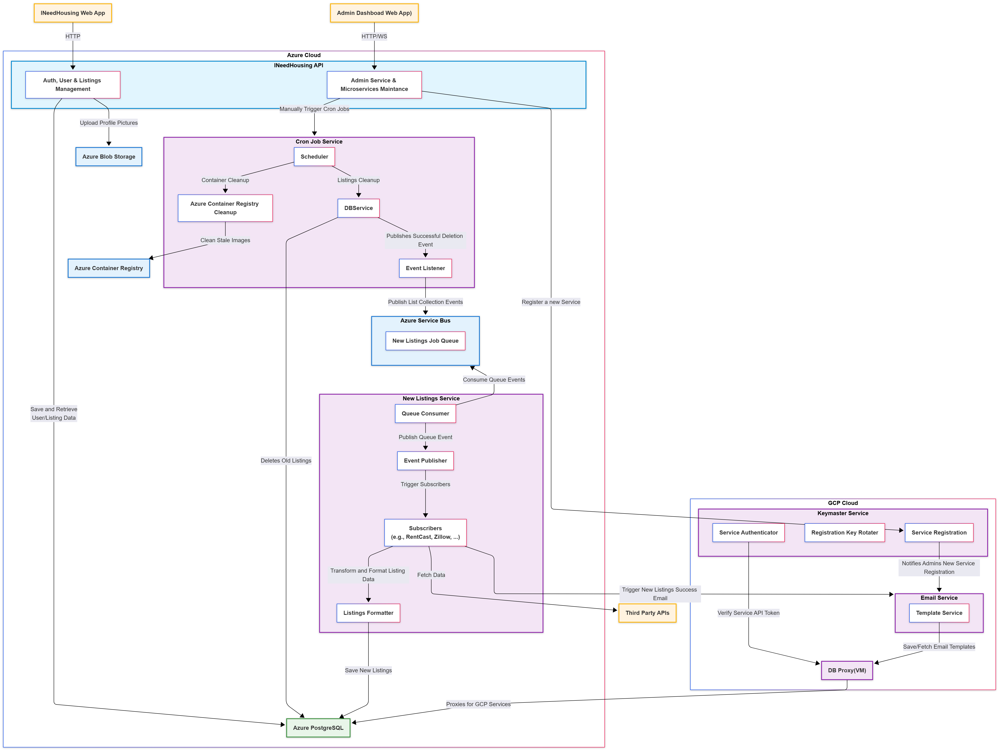

# [INeedHousing](https://i-need-housing.vercel.app)

## Overview

INeedHousing.com is a web application designed to help incoming interns and new-grad employees find housing near their workplace. The platform aggregates rental listings from various sources and provides a user-friendly interface for finding suitable accommodations through a modern, cloud-native architecture spanning multiple cloud providers.

## Architecture

INeedHousing operates as a main monolith with additional microservices system across **Azure Cloud** and **Google Cloud Platform (GCP)**, designed for scalability, reliability, and efficient data processing.

### Cloud Infrastructure

#### Azure Cloud (Primary Backend)
- **INeedHousing Web App (Next.js)**: Modern frontend application deployed on Vercel
- **INeedHousing Backend (Spring Boot 3.4.4)**: Core REST API service with comprehensive business logic
- **Cron Job Service (Quarkus 3.22.3)**: Automated maintenance and cleanup service
- **Azure PostgreSQL (Shared DB)**: Centralized relational database for all user and listing data
- **Azure Blob Storage**: File storage for user profile pictures and media
- **Azure Container Registry**: Docker image management for Azure services
- **Azure App Service**: Hosting platform for backend and cron job services

#### Google Cloud Platform (Data Processing)
- **New Listings Service (Spring Boot 3.5.4)**: Handles listing ingestion and third-party API integration
- **Keymaster Service (Quarkus 3.25.4)**: Service registration and API token generation for secure service-to-service communication
- **Database Proxy (VM)**: Secure gateway for GCP services to access Azure PostgreSQL
- **Cloud Run**: Serverless container hosting for GCP services

### Service Architecture



## Features

### Core Functionality
- **User Authentication & Authorization**: Secure JWT-based authentication system
- **User Profile Management**: Profile creation, editing, and picture uploads
- **Housing Listings**: Comprehensive property database with search and filtering
- **Location-Based Search**: Interactive map interface with Google Maps integration
- **User Preferences**: Customizable housing search preferences and filters
- **Favorites System**: Save and manage preferred listings
- **Email Verification**: Secure user account verification system

### Administrative Features
- **Admin Dashboard**: Comprehensive administrative interface
- **Live Logs Monitoring**: Real-time system monitoring via WebSocket
- **Maintenance Operations**: Manual triggering of system maintenance tasks
- **Property Management**: Admin tools for listing management and oversight

### Data Processing & Integration
- **Third-Party API Integration**: Direct integration with RentCast API and third-party APIs for Zillow & Airbnb data aggregation
- **Multi-Source Data Collection**: Gathers housing data from multiple sources for comprehensive coverage
- **Automated Listing Ingestion**: Webhook and manual trigger systems
- **Data Transformation**: Intelligent formatting and enrichment of listing data
- **Real-time Updates**: Live data synchronization across services
- **Extensible Architecture**: Designed to easily integrate additional housing data APIs in the future

### Maintenance & Operations
- **Automated Cleanup**: Scheduled cleanup of old listings and stale data
- **Container Management**: Automated cleanup of stale Docker images
- **Health Monitoring**: Comprehensive health checks and monitoring
- **Event-Driven Architecture**: Reactive system with event publishing/subscription

## Tech Stack

### Frontend
- **Framework**: Next.js 15.2.4 with React 19
- **Styling**: Tailwind CSS 3.4.1 + DaisyUI 4.12.23
- **Maps**: Google Maps API integration
- **State Management**: React Context + TanStack Query
- **Deployment**: Vercel with analytics and speed insights

### Backend Services
- **Main Backend**: Spring Boot 3.4.4 (Java 21)
- **New Listings Service**: Spring Boot 3.5.4 with Spring Cloud
- **Cron Job Service**: Quarkus 3.22.3 with WebSocket support
- **Keymaster Service**: Quarkus 3.25.4 for service registration and API token management

### Database & Storage
- **Primary Database**: Azure PostgreSQL with Hibernate Spatial
- **File Storage**: Azure Blob Storage
- **Data Access**: JPA/Hibernate with spatial data support

### Infrastructure & DevOps
- **Containerization**: Docker with multi-stage builds
- **CI/CD**: GitHub Actions with smart change detection
- **Cloud Platforms**: Azure (Primary) + Google Cloud Platform
- **Monitoring**: Health checks, live logs, and metrics
- **Security**: JWT authentication, secure key rotation

## Project Structure

```
i-need-housing/
├── frontend/                 # Next.js 15.2.4 application
│   ├── src/app/             # App router with protected/public routes
│   ├── src/components/      # Reusable UI components
│   ├── src/hooks/          # Custom React hooks
│   └── src/interfaces/     # TypeScript type definitions
├── backend/                 # Spring Boot 3.4.4 main service
│   ├── src/main/java/      # Java source code
│   │   └── com/ineedhousing/backend/
│   │       ├── auth/        # Authentication & authorization
│   │       ├── user/        # User management
│   │       ├── housing_listings/ # Property listings
│   │       ├── admin/       # Administrative features
│   │       └── azure/       # Azure service integration
├── new_listings_service/    # Spring Boot 3.5.4 data ingestion
│   └── src/main/java/      # Third-party API integration
├── cron_job_service/        # Quarkus 3.22.3 maintenance service
│   └── src/main/java/      # Scheduled tasks & cleanup
├── keymaster_service/       # Quarkus 3.25.4 service management
│   └── src/main/java/      # Service registration & API token generation
├── scripts/                 # Deployment & utility scripts
├── .github/workflows/       # CI/CD automation
└── docs/                    # Architecture & documentation
```

## Deployment & CI/CD

### Automated Deployment Pipeline
- **Production Branch**: Automatic deployment on `production` branch push
- **Smart Change Detection**: Only deploys services with actual changes
- **Multi-Cloud Deployment**:
  - Azure services via Azure Container Registry
  - GCP services via Google Artifact Registry

### Environment Management
- **Azure Environment**: Backend, Cron Job Service, and Database
- **GCP Environment**: New listings service and Keymaster service
- **Cross-Cloud Communication**: Secure proxy-based data access
- **Environment Variables**: Secure management via GitHub Secrets

## Getting Started

### Prerequisites
- Java 21 (for backend services)
- Node.js 18+ (for frontend)
- Docker (for containerization)
- Maven (for Java builds)
- Azure CLI & GCP CLI (for deployment)

### Local Development
1. **Clone the repository**
   ```bash
   git clone https://github.com/your-username/i-need-housing.git
   cd i-need-housing
   ```

2. **Set up environment variables**
   - Copy `azure.env.example` to `azure.env`
   - Copy `gcp.env.example` to `gcp.env`
   - Fill in your cloud credentials

3. **Run services locally**
   ```bash
   # Backend
   python scripts/run_backend.py
   
   # Frontend
   python scripts/run_frontend.py
   
   # Cron Service
   python scripts/run_cron_service.py
   
   # New Listings Service
   python scripts/run_new_listing.py
   ```

### Production Deployment
- **Frontend**: Automatically deployed to Vercel
- **Backend Services**: Deployed via GitHub Actions to Azure App Service
- **Cron Job Service**: Deployed via GitHub Actions to Azure App Service
- **GCP Services**: Deployed via GitHub Actions to Cloud Run
- **Database**: Azure PostgreSQL with automated backups

## API Integration

### Third-Party Services
- **Google Maps**: Location services and mapping
- **RentCast**: Direct API integration for rental market analytics and property data
- **Zillow**: Property data and market information via third-party API services
- **Airbnb**: Alternative accommodation data via third-party API services
- **Future Integrations**: Architecture designed to easily add more housing data sources

### Webhook System
- **Incoming Webhooks**: Receive listing updates from external sources
- **Outgoing Webhooks**: Notify other services of system events
- **Event Publishing**: Internal event system for service communication

## Monitoring & Maintenance

### Automated Tasks
- **Listing Cleanup**: Scheduled removal of expired listings
- **Container Cleanup**: Removal of stale Docker images
- **Database Maintenance**: Regular cleanup and optimization
- **Health Checks**: Continuous monitoring of all services

### Live Monitoring
- **WebSocket Logs**: Real-time log streaming
- **Health Endpoints**: Service health status monitoring
- **Metrics Collection**: Performance and usage analytics
- **Admin Dashboard**: Centralized monitoring interface

## Security Features

- **JWT Authentication**: Secure token-based authentication for user access
- **Service-to-Service Authentication**: API tokens generated by Keymaster Service for secure inter-service communication
- **Role-Based Access Control**: Admin and user permission levels
- **Secure Key Rotation**: Automated credential management
- **Cross-Cloud Security**: Secure proxy-based data access
- **Input Validation**: Comprehensive data sanitization
- **HTTPS Enforcement**: Secure communication protocols

## Contributing

1. Fork the repository
2. Create a feature branch (`git checkout -b feature/amazing-feature`)
3. Commit your changes (`git commit -m 'Add amazing feature'`)
4. Push to the branch (`git push origin feature/amazing-feature`)
5. Open a Pull Request

## Project Status

The project has successfully evolved from MVP to a production-ready system:

- ✅ **Complete MVP web application** - Fully functional and deployed
- ✅ **Distributed cloud architecture** - Multi-cloud deployment with Azure + GCP
- ✅ **Microservices architecture** - Scalable service-based design
- ✅ **Automated CI/CD pipeline** - Production deployment automation
- ✅ **Real-time monitoring** - Live logs and health monitoring
- ✅ **Third-party integrations** - RentCast (direct), Zillow & Airbnb (via third-party APIs), Google Maps
- ✅ **Security implementation** - JWT auth, role-based access control
- 🔄 **Continuous enhancement** - Ongoing feature development and optimization
- 🔄 **API expansion** - Architecture ready for additional housing data source integrations

## Contact

For feedback, suggestions, or inquiries, please contact [argel6767@gmail.com](mailto:argel6767@gmail.com).

## License

This project is licensed under the terms specified in the [LICENSE.md](LICENSE.md) file.